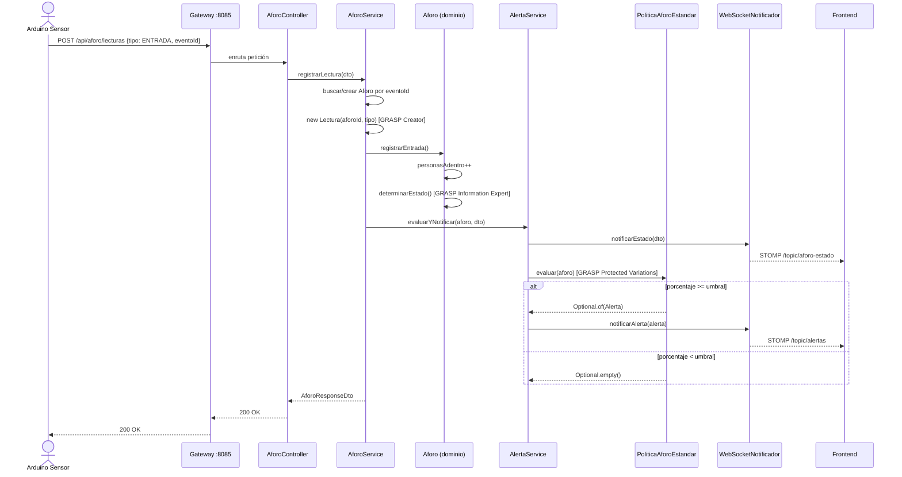

# Análisis GRASP — Coliseo Álvaro Mesa Amaya · Sistema de Aforo

> **Asignatura:** Programación Avanzada  
> **Patrón evaluado:** GRASP (General Responsibility Assignment Software Patterns)  
> **Arquitectura base:** Hexagonal / Clean Architecture sobre 4 microservicios Spring Boot 3.2.5 / Java 21

---

## Tabla de contenido

1. [Resumen ejecutivo](#1-resumen-ejecutivo)  
2. [Mapa de responsabilidades por principio](#2-mapa-de-responsabilidades-por-principio)  
3. [Information Expert](#3-information-expert)  
4. [Controller](#4-controller)  
5. [Low Coupling](#5-low-coupling)  
6. [Protected Variations](#6-protected-variations)  
7. [High Cohesion](#7-high-cohesion)  
8. [Creator](#8-creator)  
9. [Clases nuevas creadas para cumplir GRASP](#9-clases-nuevas-creadas-para-cumplir-grasp)  
10. [Diagrama UML de clases](#10-diagrama-uml-de-clases)  
11. [Diagrama de secuencia](#11-diagrama-de-secuencia)  

---

## 1. Resumen ejecutivo

El proyecto aplica **6 principios GRASP** de forma explícita y verificable en el código fuente. La tabla a continuación lista cada principio, el archivo concreto que lo respeta y el método o patrón de evidencia:

| # | Principio GRASP | Archivo(s) clave | Evidencia concreta |
|---|---|---|---|
| 1 | Information Expert | `Aforo.java` | `calcularPorcentaje()`, `determinarEstado()` |
| 1 | Information Expert | `RegistroHistorico.java` | Calcula `porcentaje` en el constructor |
| 1 | Information Expert | `Evento.java` | `activar()`, `cerrar()`, `isActivo()` |
| 1 | Information Expert | `Usuario.java` | `tienePermiso(String)` |
| 2 | Controller | `AforoController.java` | Único punto HTTP del sensor |
| 2 | Controller | `EventoController.java` | Único punto HTTP del ciclo de vida de eventos |
| 2 | Controller | `UsuarioController.java` | Único punto HTTP de autenticación |
| 3 | Low Coupling | `IAforoRepository.java` | `AforoService` no depende de JPA |
| 3 | Low Coupling | `IAlertaNotificador.java` | `AlertaService` no depende de WebSocket |
| 3 | Low Coupling | `IPoliticaAforo.java` ⭐ | `AlertaService` no depende de umbrales |
| 3 | Low Coupling | `IUserRepository.java` | `AutenticacionService` no depende de JPA |
| 3 | Low Coupling | `IPasswordHasher.java` | `AutenticacionService` no depende de BCrypt |
| 4 | Protected Variations | `IAlertaNotificador` / `WebSocketNotificador` | Canal de notificación intercambiable |
| 4 | Protected Variations | `IPoliticaAforo` / `PoliticaAforoEstandar` ⭐ | Política de umbrales intercambiable |
| 4 | Protected Variations | `IAforoRepository` / `AforoRepositoryAdapter` | Base de datos intercambiable |
| 4 | Protected Variations | `IPasswordHasher` / `BCryptPasswordHasher` | Algoritmo de hash intercambiable |
| 5 | High Cohesion | `AlertaService.java` | Una sola responsabilidad: evaluar + notificar |
| 5 | High Cohesion | `JwtTokenProvider.java` | Una sola responsabilidad: generar/validar JWT |
| 5 | High Cohesion | `ReporteService.java` | Una sola responsabilidad: snapshots + resumen |
| 6 | Creator | `AforoService.registrarLectura()` | Crea objetos `Lectura` |
| 6 | Creator | `ReporteService.guardarRegistro()` | Crea objetos `RegistroHistorico` |
| 6 | Creator | `EventoService.crearEvento()` | Crea objetos `Evento` |

> ⭐ = Clase o interfaz **creada en esta iteración** específicamente para reforzar GRASP.

---

## 2. Mapa de responsabilidades por principio

```
aforo-ms
├── domain
│   └── Aforo.java                  → Information Expert, Creator (destino)
├── application
│   ├── AforoService.java           → Controller (interno), Creator, Low Coupling
│   ├── AlertaService.java          → High Cohesion, Low Coupling
│   └── PoliticaAforoEstandar.java  ⭐ → Protected Variations (impl. concreta)
├── port
│   ├── IAforoRepository.java       → Low Coupling
│   ├── IAlertaNotificador.java     → Low Coupling, Protected Variations
│   └── IPoliticaAforo.java         ⭐ → Low Coupling, Protected Variations (interfaz)
├── infrastructure
│   ├── AforoRepositoryAdapter.java → Protected Variations (JPA adapter)
│   └── WebSocketNotificador.java   → Protected Variations (WS adapter)
└── presentation
    └── AforoController.java        → Controller (GRASP)

eventos-ms
├── domain
│   └── Evento.java                 → Information Expert
├── application
│   └── EventoService.java          → Creator, Low Coupling
├── port
│   └── IEventoRepository.java      → Low Coupling
└── presentation
    └── EventoController.java       → Controller (GRASP)

reportes-ms
├── domain
│   └── RegistroHistorico.java      → Information Expert
├── application
│   └── ReporteService.java         → High Cohesion, Creator, Low Coupling
└── port
    └── IRegistroRepository.java    → Low Coupling

usuarios-ms
├── domain
│   └── Usuario.java                → Information Expert
├── application
│   └── AutenticacionService.java   → High Cohesion, Low Coupling
├── port
│   ├── IUserRepository.java        → Low Coupling, Protected Variations
│   └── IPasswordHasher.java        → Low Coupling, Protected Variations
├── infrastructure
│   ├── BCryptPasswordHasher.java   → Protected Variations (impl. concreta)
│   ├── JwtTokenProvider.java       → High Cohesion
│   └── JwtAuthFilter.java          → Single-purpose filter
└── presentation
    └── UsuarioController.java      → Controller (GRASP)
```

---

## 3. Information Expert

> **Principio:** Asignar la responsabilidad al objeto que posee la información necesaria para cumplirla.

### 3.1 `Aforo.java` — `aforo-ms/src/main/java/com/coliseo/aforo/domain/Aforo.java`

`Aforo` almacena `personasAdentro` y `aforoMaximo`. **Nadie más** calcula el porcentaje ni el estado; la clase lo hace internamente:

```java
// GRASP Information Expert: Aforo posee personasAdentro y aforoMaximo,
// por lo tanto es responsable de calcular el porcentaje y el estado.

public float calcularPorcentaje() {
    if (aforoMaximo == 0) return 0;
    return ((float) personasAdentro / aforoMaximo) * 100;
}

public EstadoAforo determinarEstado() {
    float pct = calcularPorcentaje();
    if (pct >= 100) return EstadoAforo.LLENO;
    if (pct >= 70)  return EstadoAforo.ALERTA;
    return EstadoAforo.LIBRE;
}

public void registrarEntrada() {
    if (personasAdentro < aforoMaximo) personasAdentro++;
    this.estado = determinarEstado();    // auto-actualiza
}
```

**Métodos de dominio:** `registrarEntrada()`, `registrarSalida()`, `resetear()`, `calcularPorcentaje()`, `determinarEstado()`

---

### 3.2 `RegistroHistorico.java` — `reportes-ms/.../domain/RegistroHistorico.java`

Calcula su propio campo derivado `porcentaje` en el constructor, sin delegar al servicio:

```java
public RegistroHistorico(UUID eventoId, int personasAdentro, int aforoMaximo) {
    this.eventoId        = eventoId;
    this.personasAdentro = personasAdentro;
    this.aforoMaximo     = aforoMaximo;
    // Information Expert: el objeto calcula su propio porcentaje
    this.porcentaje      = aforoMaximo > 0 ? (personasAdentro * 100.0 / aforoMaximo) : 0;
    this.timestamp       = LocalDateTime.now();
}
```

---

### 3.3 `Evento.java` — `eventos-ms/.../domain/Evento.java`

La entidad `Evento` conoce su propio estado y expone las transiciones:

```java
public void activar()  { this.estado = EstadoEvento.ACTIVO; }
public void cerrar()   { this.estado = EstadoEvento.CERRADO; }
public boolean isActivo() { return EstadoEvento.ACTIVO.equals(this.estado); }
```

Nadie fuera del dominio modifica el enum; se respeta el principio Tell-Don't-Ask.

---

### 3.4 `Usuario.java` — `usuarios-ms/.../domain/Usuario.java`

`Usuario` posee su colección de `Rol`es y es el único que puede responder si tiene un permiso:

```java
public boolean tienePermiso(String codigoPermiso) {
    return roles.stream().anyMatch(r -> r.tienePermiso(codigoPermiso));
}
```

---

## 4. Controller

> **Principio:** Delegar los mensajes que llegan del sistema externo a un controlador que no contenga lógica de negocio propia.

Los tres controladores del sistema actúan exclusivamente como receptores HTTP: validan la entrada, delegan al servicio correspondiente y devuelven el resultado. **No contienen lógica de negocio**.

### 4.1 `AforoController.java` — `aforo-ms/.../presentation/AforoController.java`

```java
@RestController
@RequestMapping("/api/aforo")
public class AforoController {

    private final AforoService aforoService;

    @PostMapping("/lecturas")
    public ResponseEntity<AforoResponseDto> registrarLectura(@RequestBody LecturaRequestDto dto) {
        return ResponseEntity.ok(aforoService.registrarLectura(dto));   // delega, no decide
    }

    @GetMapping("/estado")
    public ResponseEntity<AforoResponseDto> obtenerEstado(...) { ... }

    @PostMapping("/reset")
    public ResponseEntity<Void> resetear(...) { ... }
}
```

### 4.2 `EventoController.java` — `eventos-ms/.../presentation/EventoController.java`

Recibe las peticiones del ciclo de vida (crear, activar, cerrar, listar) y las delega a `EventoService`.

### 4.3 `UsuarioController.java` — `usuarios-ms/.../presentation/UsuarioController.java`

Recibe `/login` y `/register`, delega a `AutenticacionService` y retorna el JWT; no interpreta el token.

---

## 5. Low Coupling

> **Principio:** Reducir las dependencias entre componentes para que los cambios en uno no afecten a los demás.

Todos los servicios del proyecto dependen de **interfaces**, no de implementaciones concretas. Las implementaciones son inyectadas en tiempo de ejecución por Spring (inversión de control).

### Interfaces de puerto y sus implementaciones

| Interfaz | Implementación concreta | Microservicio | Quién la usa |
|---|---|---|---|
| `IAforoRepository` | `AforoRepositoryAdapter` | aforo-ms | `AforoService`, `AlertaService` |
| `IAlertaNotificador` | `WebSocketNotificador` | aforo-ms | `AlertaService` |
| `IPoliticaAforo` ⭐ | `PoliticaAforoEstandar` | aforo-ms | `AlertaService` |
| `IEventoRepository` | `EventoRepositoryAdapter` | eventos-ms | `EventoService` |
| `IRegistroRepository` | `RegistroRepositoryAdapter` | reportes-ms | `ReporteService` |
| `IUserRepository` | `UsuarioRepositoryAdapter` | usuarios-ms | `AutenticacionService` |
| `IPasswordHasher` | `BCryptPasswordHasher` | usuarios-ms | `AutenticacionService` |

### Evidencia — `AlertaService.java`

```java
@Service
public class AlertaService {

    private final IAlertaNotificador notificador;   // no conoce WebSocket
    private final IAforoRepository   aforoRepository; // no conoce JPA
    private final IPoliticaAforo     politica;       // no conoce los umbrales

    public AlertaService(IAlertaNotificador notificador,
                         IAforoRepository aforoRepository,
                         IPoliticaAforo politica) { ... }
}
```

### Evidencia — `AutenticacionService.java`

```java
public class AutenticacionService {
    private final IUserRepository userRepository;   // no conoce JPA
    private final IPasswordHasher passwordHasher;   // no conoce BCrypt
    private final JwtTokenProvider jwtTokenProvider;
}
```

---

## 6. Protected Variations

> **Principio:** Identificar los puntos de variación previsibles y proteger al sistema de su impacto mediante una interfaz estable.

### 6.1 Política de umbrales — `IPoliticaAforo` + `PoliticaAforoEstandar` ⭐

**Punto de variación:** los umbrales del aforo pueden cambiar (por normativa, tipo de evento, aforo reducido).

**Antes del refactor:** la lógica estaba codificada directamente en `AlertaService` con `if porcentaje >= 70 / 90 / 100`.  
**Después:** `AlertaService` llama a `politica.evaluar(aforo)` y no sabe nada de los números:

```java
// IPoliticaAforo.java — la interfaz estable
public interface IPoliticaAforo {
    Optional<Alerta> evaluar(Aforo aforo);
}

// PoliticaAforoEstandar.java — la variación concreta
public class PoliticaAforoEstandar implements IPoliticaAforo {
    private static final int UMBRAL_ALERTA = 70;
    private static final int UMBRAL_ALTO   = 90;
    private static final int UMBRAL_LLENO  = 100;

    @Override
    public Optional<Alerta> evaluar(Aforo aforo) {
        float pct = aforo.calcularPorcentaje();
        if (pct >= UMBRAL_LLENO)  return Optional.of(new Alerta("LLENO",  ...));
        if (pct >= UMBRAL_ALTO)   return Optional.of(new Alerta("ALTO",   ...));
        if (pct >= UMBRAL_ALERTA) return Optional.of(new Alerta("ALERTA", ...));
        return Optional.empty();
    }
}
```

Una `PoliticaAforoCovid` (50% de aforo) o `PoliticaAforoConcierto` (umbrales distintos) se puede agregar **sin tocar** `AlertaService`.

---

### 6.2 Canal de notificación — `IAlertaNotificador` + `WebSocketNotificador`

**Punto de variación:** hoy se usa WebSocket (STOMP), mañana puede ser e-mail, SMS o push.

```java
public interface IAlertaNotificador {
    void notificarEstado(AforoResponseDto estado);
    void notificarAlerta(Alerta alerta);
}
```

`AlertaService` llama a `notificador.notificarEstado(...)` y **nunca** referencia `SimpMessagingTemplate` (la clase de Spring para WebSocket). Si se cambia el canal, cero cambios en `AlertaService`.

---

### 6.3 Algoritmo de hash — `IPasswordHasher` + `BCryptPasswordHasher`

```java
public interface IPasswordHasher {
    String hash(String rawPassword);
    boolean matches(String rawPassword, String hashedPassword);
}
```

`BCryptPasswordHasher` es la implementación actual. Si el equipo migra a Argon2, solo se cambia el bean; `AutenticacionService` no se modifica.

---

### 6.4 Persistencia — `IAforoRepository` + `AforoRepositoryAdapter`

`AforoService` nunca llama a `JpaRepository` directamente; delega a `IAforoRepository`. Si se cambia de H2 a PostgreSQL o a MongoDB, solo cambia el adaptador de infraestructura.

---

## 7. High Cohesion

> **Principio:** Cada clase debe tener responsabilidades fuertemente relacionadas y hacer una cantidad razonable de trabajo.

### 7.1 `AlertaService.java` — `aforo-ms/.../application/AlertaService.java`

Antes del refactor, `AlertaService` mezclaba: lógica de umbrales (`if pct >= 70`) + envío de WebSocket + consultas al repositorio. Tras el refactor, **su única responsabilidad** es coordinar la evaluación y la notificación:

```java
public void evaluarYNotificar(Aforo aforo, AforoResponseDto estadoDto) {
    notificador.notificarEstado(estadoDto);             // 1. siempre notificar el estado
    politica.evaluar(aforo)
            .ifPresent(notificador::notificarAlerta);   // 2. si hay alerta, notificarla
}
```

Dos líneas lógicas. Cero if/else de umbrales en el servicio.

---

### 7.2 `JwtTokenProvider.java` — `usuarios-ms/.../infrastructure/security/JwtTokenProvider.java`

Clase con exactamente dos responsabilidades bien definidas: **generar** tokens y **validar** tokens. No autentica, no persiste, no filtra peticiones HTTP.

```java
public String generateToken(String username) { ... }
public boolean validateToken(String token)   { ... }
public String getUsernameFromToken(String token) { ... }
```

---

### 7.3 `ReporteService.java` — `reportes-ms/.../application/ReporteService.java`

Responsabilidades únicas: persistir snapshots de aforo y calcular el resumen estadístico de un evento. No gestiona eventos, no autentica, no envía notificaciones.

```java
public RegistroHistorico guardarRegistro(UUID eventoId, int personasAdentro, int aforoMaximo) { ... }
public ResumenEvento      calcularResumen(UUID eventoId)  { ... }
public List<RegistroHistorico> obtenerHistorial(UUID eventoId) { ... }
```

---

## 8. Creator

> **Principio:** Asignar la responsabilidad de crear un objeto A a la clase B si B agrega, contiene, registra o usa instancias de A.

| Clase creadora | Objeto creado | Relación justificante |
|---|---|---|
| `AforoService.registrarLectura()` | `new Lectura(aforoId, tipo)` | `AforoService` es quien registra y conoce el `aforoId` y el `tipo` |
| `ReporteService.guardarRegistro()` | `new RegistroHistorico(eventoId, personas, max)` | `ReporteService` es quien almacena y posee los datos necesarios |
| `EventoService.crearEvento()` | `new Evento(nombre, fecha, aforoMax)` | `EventoService` gestiona el ciclo de vida completo de `Evento` |

### Evidencia — `AforoService.java`

```java
// GRASP Creator: AforoService crea el objeto Lectura
Lectura lectura = new Lectura(aforo.getId(), dto.getTipo());
aforoRepository.saveLectura(lectura);
```

### Evidencia — `ReporteService.java`

```java
public RegistroHistorico guardarRegistro(UUID eventoId, int personasAdentro, int aforoMaximo) {
    RegistroHistorico registro = new RegistroHistorico(eventoId, personasAdentro, aforoMaximo);
    return registroRepository.save(registro);
}
```

---

## 9. Clases nuevas creadas para cumplir GRASP

Estas dos clases fueron introducidas en el proyecto para resolver una violación de **Protected Variations** y **Low Coupling** en `AlertaService`:

### `IPoliticaAforo.java`
**Ruta:** `aforo-ms/src/main/java/com/coliseo/aforo/application/port/IPoliticaAforo.java`

```java
package com.coliseo.aforo.application.port;

import com.coliseo.aforo.domain.Aforo;
import com.coliseo.aforo.domain.Alerta;
import java.util.Optional;

/**
 * GRASP Protected Variations + Low Coupling.
 *
 * Define el contrato para evaluar si el estado actual de un Aforo
 * requiere emitir una Alerta. Las implementaciones concretas (como
 * PoliticaAforoEstandar) pueden variar sin afectar a AlertaService.
 */
public interface IPoliticaAforo {
    Optional<Alerta> evaluar(Aforo aforo);
}
```

---

### `PoliticaAforoEstandar.java`
**Ruta:** `aforo-ms/src/main/java/com/coliseo/aforo/application/PoliticaAforoEstandar.java`

```java
package com.coliseo.aforo.application;

import com.coliseo.aforo.application.port.IPoliticaAforo;
import com.coliseo.aforo.domain.Aforo;
import com.coliseo.aforo.domain.Alerta;
import org.springframework.stereotype.Component;
import java.util.Optional;

/**
 * Implementación estándar de IPoliticaAforo con 3 umbrales:
 *   70% → ALERTA   (amarillo)
 *   90% → ALTO     (naranja)
 *  100% → LLENO    (rojo)
 *
 * GRASP Protected Variations: cambiar umbrales o agregar una política
 * distinta (ej. PoliticaAforoCovid al 50%) no requiere tocar AlertaService.
 */
@Component
public class PoliticaAforoEstandar implements IPoliticaAforo {

    private static final int UMBRAL_ALERTA = 70;
    private static final int UMBRAL_ALTO   = 90;
    private static final int UMBRAL_LLENO  = 100;

    @Override
    public Optional<Alerta> evaluar(Aforo aforo) {
        float pct = aforo.calcularPorcentaje();

        if (pct >= UMBRAL_LLENO) {
            return Optional.of(new Alerta("LLENO",
                    "Aforo al 100%. Acceso bloqueado.", aforo.getId()));
        }
        if (pct >= UMBRAL_ALTO) {
            return Optional.of(new Alerta("ALTO",
                    "Aforo al 90%. Restricción inminente.", aforo.getId()));
        }
        if (pct >= UMBRAL_ALERTA) {
            return Optional.of(new Alerta("ALERTA",
                    "Aforo al 70%. Monitoreo activo.", aforo.getId()));
        }
        return Optional.empty();
    }
}
```

---

## 10. Diagrama UML de clases

```mermaid
classDiagram
    %% ─── aforo-ms ───────────────────────────────────────────
    class Aforo {
        -UUID id
        -int personasAdentro
        -int aforoMaximo
        -EstadoAforo estado
        -UUID eventoId
        +registrarEntrada()
        +registrarSalida()
        +resetear()
        +calcularPorcentaje() float
        +determinarEstado() EstadoAforo
    }

    class Lectura {
        -UUID id
        -UUID aforoId
        -TipoLectura tipo
        -LocalDateTime timestamp
    }

    class AforoService {
        +registrarLectura(dto) AforoResponseDto
        +obtenerEstado(eventoId) AforoResponseDto
        +resetear(eventoId)
    }

    class AlertaService {
        +evaluarYNotificar(aforo, dto)
    }

    class PoliticaAforoEstandar {
        -int UMBRAL_ALERTA = 70
        -int UMBRAL_ALTO   = 90
        -int UMBRAL_LLENO  = 100
        +evaluar(aforo) Optional~Alerta~
    }

    class AforoController {
        +registrarLectura(dto) ResponseEntity
        +obtenerEstado(eventoId) ResponseEntity
        +resetear(eventoId) ResponseEntity
    }

    class WebSocketNotificador {
        +notificarEstado(dto)
        +notificarAlerta(alerta)
    }

    class AforoRepositoryAdapter {
        +findByEventoId(id) Optional~Aforo~
        +save(aforo) Aforo
        +saveLectura(lectura)
    }

    class IAforoRepository {
        <<interface>>
        +findByEventoId(id) Optional~Aforo~
        +save(aforo) Aforo
        +saveLectura(lectura)
    }

    class IAlertaNotificador {
        <<interface>>
        +notificarEstado(dto)
        +notificarAlerta(alerta)
    }

    class IPoliticaAforo {
        <<interface>>
        +evaluar(aforo) Optional~Alerta~
    }

    AforoController --> AforoService
    AforoService --> IAforoRepository
    AforoService --> AlertaService
    AforoService ..> Lectura : «creates»
    AlertaService --> IAlertaNotificador
    AlertaService --> IPoliticaAforo
    IPoliticaAforo <|.. PoliticaAforoEstandar
    IAlertaNotificador <|.. WebSocketNotificador
    IAforoRepository <|.. AforoRepositoryAdapter
    AforoService ..> Aforo : «uses»

    %% ─── eventos-ms ─────────────────────────────────────────
    class Evento {
        -UUID id
        -String nombre
        -LocalDate fecha
        -int aforoMaximo
        -EstadoEvento estado
        +activar()
        +cerrar()
        +isActivo() boolean
    }

    class EventoService {
        +crearEvento(dto) Evento
        +activarEvento(id) Evento
        +cerrarEvento(id) Evento
        +obtenerActivo() Optional~Evento~
        +listarEventos() List~Evento~
    }

    class IEventoRepository {
        <<interface>>
        +save(e) Evento
        +findById(id) Optional~Evento~
        +findActivo() Optional~Evento~
        +findAll() List~Evento~
    }

    EventoService --> IEventoRepository
    EventoService ..> Evento : «creates»

    %% ─── reportes-ms ─────────────────────────────────────────
    class RegistroHistorico {
        -UUID eventoId
        -int personasAdentro
        -int aforoMaximo
        -double porcentaje
        -LocalDateTime timestamp
    }

    class ReporteService {
        +guardarRegistro(eventoId, personas, max) RegistroHistorico
        +calcularResumen(eventoId) ResumenEvento
        +obtenerHistorial(eventoId) List~RegistroHistorico~
    }

    class IRegistroRepository {
        <<interface>>
        +save(r) RegistroHistorico
        +findByEventoId(id) List~RegistroHistorico~
    }

    ReporteService --> IRegistroRepository
    ReporteService ..> RegistroHistorico : «creates»

    %% ─── usuarios-ms ─────────────────────────────────────────
    class Usuario {
        -UUID id
        -String username
        -String email
        -boolean active
        -Set~Rol~ roles
        +tienePermiso(codigo) boolean
    }

    class AutenticacionService {
        +login(dto) LoginResponseDto
        +register(dto) Usuario
    }

    class IUserRepository {
        <<interface>>
        +findByUsername(u) Optional~Usuario~
        +save(u) Usuario
    }

    class IPasswordHasher {
        <<interface>>
        +hash(raw) String
        +matches(raw, hashed) boolean
    }

    class BCryptPasswordHasher {
        +hash(raw) String
        +matches(raw, hashed) boolean
    }

    class JwtTokenProvider {
        +generateToken(username) String
        +validateToken(token) boolean
        +getUsernameFromToken(token) String
    }

    AutenticacionService --> IUserRepository
    AutenticacionService --> IPasswordHasher
    AutenticacionService --> JwtTokenProvider
    IPasswordHasher <|.. BCryptPasswordHasher
```



---

## 11. Diagrama de secuencia

### Caso de uso: Registrar lectura del sensor y activar alerta



---

## Referencias

| Principio | Fuente |
|---|---|
| GRASP (Craig Larman) | *Applying UML and Patterns*, 3rd ed., cap. 17 |
| Hexagonal Architecture | Alistair Cockburn — *Ports and Adapters* |
| Protected Variations | Larman, GRASP 9 — shield variation points with stable interfaces |
| Low Coupling | Larman, GRASP 3 — depend on abstractions, not concretions |
